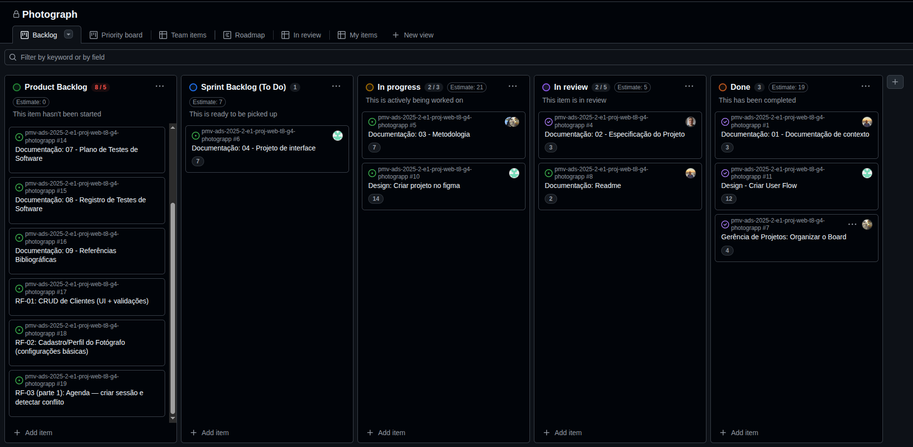

# Metodologia

Este documento descreve a metodologia de desenvolvimento adotada para o projeto Photograpp – Sistema para Fotógrafos, utilizando o Scrum. O objetivo é garantir previsibilidade nas entregas, qualidade e alinhamento contínuo com os requisitos funcionais (RF) e não funcionais (RNF) do produto.

O SCRUM foi escolhido como metodologia ágil para o desenvolvimento deste projeto, pois como citam Amaral, Fleury e Isoni (2019, p. 68), seus benefícios são a

“visão clara dos resultados a entregar; ritmo e disciplina necessários à execução; definição de papéis e responsabilidades dos integrantes do projeto (Scrum Owner, Scrum Master e Team); empoderamento dos membros da equipe de projetos para atingir o desafio; conhecimento distribuído e compartilhado de forma colaborativa; ambiência favorável para crítica às ideias e não às pessoas.”

## 1. Papéis e Responsabilidades

- Scrum Master: D'Angeles Lima
  - Facilita cerimônias, remove impedimentos, promove a aderência ao processo e às políticas do repositório/board.
- Product Owner (PO): Yago Rodrigues
  - Mantém e prioriza o Product Backlog; define e valida critérios de aceitação; aceita/recusa incrementos na Sprint Review.
- Equipe de Desenvolvimento: Yago Rodrigues, Yuri Jardim, D'Angeles Lima, Gustavo Santiago, Ariana Paz
  - Implementação, testes, documentação técnica, revisão de código e automação de build/deploy.
- Equipe de Design: Ariana Paz, Gustavo Santiago
  - Design System, fluxos e protótipos no Figma; handoff (tokens, especificações); validação de usabilidade e acessibilidade.

## 2. Cadência e Cerimônias

- Sprints: 1 a 2 semanas (manter duração fixa para previsibilidade).
- Sprint Planning (por videochamada, até 2h):
  - Entradas: Product Backlog priorizado, capacidade do time, RF/RNF relevantes.
  - Saídas: Sprint Goal (meta do Sprint) e Sprint Backlog (itens com Definition of Ready cumprida), estimativas e tarefas.
- Daily Scrum (assíncrona, por texto, ao final do dia – ver Seção 3):
  - Objetivo: inspecionar progresso em direção ao Sprint Goal e identificar impedimentos.
- Sprint Review (por videochamada, 30–60 min):
  - Demonstração do incremento “potencialmente publicável”; validação do PO conforme critérios de aceitação; coleta de feedback.
- Sprint Retrospective (por videochamada, 45–60 min):
  - Inspeção do processo; definição de 1–3 melhorias acionáveis com responsáveis e prazos.
- Product Backlog Refinement (atividade contínua; sessão por videochamada 1x/semana, 45–60 min – opcional):
  - Detalhamento de histórias, divisão em tarefas, anexos de referência (Figma), critérios de aceitação e dependências.

## 3. Daily por Texto (assíncrona)

- Quando: todos os dias úteis, até horário fixo (ex.: 21h BRT).
- Onde: tópico/thread persistente (ex.: GitHub Discussions, issue “Daily Scrum – Semana XX” ou canal de chat do time).
- Formato (template a ser postado por cada membro):

```
[DATA] - Daily (NOME)
1) O que fiz hoje:
- ...

2) O que farei amanhã:
- ...

3) Impedimentos/ajuda necessária:
- ...

4) Links relevantes (PRs, issues, preview):
- ...
```

- Responsabilidades:
  - Cada membro posta até o horário combinado.
  - Scrum Master monitora impedimentos (label "blocked" na issue) e aciona responsáveis.
  - Atualizações no board devem acompanhar as dailies (mover cartões conforme estado real).
- Boas práticas:
  - Mensagens objetivas e verificáveis (incluir links).
  - Em fusos diferentes, estabelecer uma janela comum (ex.: até 18h BRT) e manter a disciplina.

## 4. Quadro de Trabalho (GitHub Projects)

- Colunas (enxutas, focadas no Sprint):
  - **Product Backlog** - lista priorizada de tudo que pode ser feito no produto; fonte para planejar próximos Sprints.
  - **Sprint Backlog (To Do)** - itens selecionados para o Sprint, prontos e ainda não iniciados.
  - **In Progress** - itens em desenvolvimento, com trabalho ativo em andamento.
  - **In Review** - implementação finalizada, em revisão de código/testes e aguardando aprovações.
  - **Done** - cumpre a Definition of Done, testado/integrado e pronto para release.

<figure> 
   
    <figcaption>  Figura 1 - Screenshot do Quadro de Trabalho em um momento durante uma Sprint</figcaption>
</figure> 


## 5. Gestão de Backlog e Critérios

- Product Backlog: visão de produto priorizada pelo PO (orientada por valor, RF/RNF e feedback da Review).
- Sprint Backlog: subconjunto selecionado na Planning, granular em tarefas quando necessário.
- Definition of Ready (DoR) – para entrar no Sprint:
  - História clara (quem/o que/por que), critérios de aceitação testáveis, referência de design (Figma) e dependências mapeadas; estimada e priorizada.
- Definition of Done (DoD) – para considerar “Done”:
  - Código revisado (PR aprovado), testes mínimos passando, responsividade verificada, acessibilidade básica (WCAG 2.1), performance dentro do esperado (inclui RNF-04: upload < ~5s por imagem média de 5MB em rede estável), documentação atualizada (README/CHANGELOG), e publicação quando aplicável.

## 6. Etiquetas (Labels) e Metadados

- **Etiquetas principais**
  - **Tipo**
    - Bug (erro no código)
    - Feature (nova funcionalidade)
    - Enhancement (melhoria)
    - Documentation (documentação)
    - Tests (testes)
    - Infrastructure (infraestrutura)
    - Design
    - Project-management (gerência de projetos)
  - **Prioridade**
    - P0 – crítica
    - P1 – alta
    - P2 – média
    - P3 – baixa
  - **Estimativa**
    - Story points: 1, 2, 3, 5, 8, 13
    - Tamanhos relativos: S / M / L / XL
  - **Área/Módulo**
    - Clientes
    - Agenda
    - Contratos
    - Kanban
    - Galeria
    - Notificações
    - Financeiro
    - Landing
  - **Estado extra (quando aplicável)**
    - Blocked
    - Needs-design
    - Needs-PO
    - Needs-info

<figure> 
  Figura 3 - Exemplo de esquema de cores de algumas categorias de etiquetas</figcaption>
</figure> 

## 7. Ferramentas

| Ambiente                    | Plataforma      | Link de acesso                                                                                                       |
| --------------------------- | --------------- | -------------------------------------------------------------------------------------------------------------------- |
| Repositório de código fonte | GitHub          | https://github.com/ICEI-PUC-Minas-PMV-ADS/pmv-ads-2025-2-e1-proj-web-t8-g4-photograpp/blob/main/README.md            |
| Documentos do projeto       | GitHub (docs/)  | https://github.com/ICEI-PUC-Minas-PMV-ADS/pmv-ads-2025-2-e1-proj-web-t8-g4-photograpp/blob/main/documentos           |
| Projeto de Interface        | Figma           | https://www.figma.com/board/VgYIv3lfbpj9n7BhTV3FiY/Photograpp---User-Flow---Sitemap?node-id=0-1&t=zuAfz8O68Xobcecy-1 |
| Gerenciamento do Projeto    | GitHub Projects | https://github.com/orgs/ICEI-PUC-Minas-PMV-ADS/projects/2360                                                         |
| Hospedagem (site)           | GitHub Pages    | O Link ficará disponível após a configuraração do Github Pages no repositório                                        |

## 8. Estratégia de Organização e Codificação

- Estrutura de pastas:
  - `codigo-fonte/` (componentes, páginas, assets, serviços)
  - `public/` (arquivos estáticos)
  - `testes/` (unitários e e2e)
  - `documentos/` (documentação publicada no Pages)
  - `apresentacao/` (apresentação final do projeto)
- Branching:
  - Trunk-based com feature branches; `main` protegido.
  - Padrões: `feature/rf-01-clientes`, `bugfix/...`, `chore/...`.
  - Um PR por história/tópico; preferir merges pequenos e frequentes.
- Convenções:
  - Conventional Commits (`feat:`, `fix:`, `docs:`, `refactor:`, `test:`, `chore:`, `perf:`).
  - Versionamento semântico (semver) para releases.
  - Lint/format (ESLint + Prettier);
- Revisões de código:
  - Mínimo 1 revisor; descrição clara; screenshots de UI quando aplicável; links para issues/Figma.
- Documentação:
  - README com setup, scripts e visão de arquitetura.
  - CHANGELOG por release.
  - ADRs (opcional) para decisões arquiteturais relevantes.

## 9. Testes e Qualidade

- Níveis de teste:
  - Unitários (componentes/utilitários).
  - Integração (fluxos entre componentes).
  - E2E (caminhos críticos: clientes, agendamento, seleção de fotos, contratos PDF).
- Acessibilidade:
  - Checagens automatizadas e verificação manual (foco por teclado, contraste, labels) conforme WCAG 2.1.
- Performance:
  - RNF-04: upload < ~5s por imagem (~5MB) em rede estável; usar compressão/otimização client-side quando possível.
- Cross-browser e responsividade:
  - Chrome, Edge, Firefox, Safari (RNF-01); variados tamanhos de tela (RNF-02).
- QA checklist por história (exemplo):
  - Critérios de aceitação atendidos
  - Responsividade verificada
  - Acessibilidade básica (a11y)
  - Sem erros no console
  - Mensagens de erro/estados vazios tratados
  - Performance dentro do esperado

## 10. Segurança, Privacidade e LGPD

- Dados pessoais (PII) e imagens:
  - Coleta mínima e consentimento explícito para uso/divulgação.
  - Contratos contemplam tratamento de dados e direitos de imagem.
  - HTTPS em toda a navegação; evitar exposição de links públicos não autorizados de galerias.
  - Retenção mínima e exclusão sob demanda.
  - Controle de acesso a páginas do cliente (tokens/links expiráveis).
- Logs sem informações sensíveis; mascarar PII em diagnósticos.

## 11. Métricas (Scrum)

- Burndown do Sprint (acompanhamento diário).
- Velocity por Sprint (para previsibilidade de planejamento).
- Qualidade (opcionais): bugs por Sprint, taxa de retrabalho.

## 12. Riscos e Mitigações (exemplos)

- Estouro de escopo: priorização rigorosa (ex.: MoSCoW), renegociação com PO.
- Desempenho de upload: compressão/resize client-side, feedback de progresso, processamento em lotes.
- Atraso em design: uso de componentes padrão/Design System mínimo; handoff incremental.
- Dependências externas (ex.: geração de PDF): protótipos técnicos (spikes) antecipados.
- Disponibilidade do time: pareamento, documentação e issues bem descritas (reduzir bus factor).

## 13. Roadmap de Entregas (exemplo alinhado à documentação e aos RFs)

- Sprint 1: Documentação de Contexto, Especificação do Projeto.
- Sprint 2: Metodologia, Projeto de Interface e Design.
- Sprint 3: Template padrão da Aplicação, navegação, RF-01 (clientes), RF-02 (fotógrafos), responsividade básica.
- Sprint 4: RF-03 (agenda com conflitos), RF-05 (pipeline Kanban visual interno), RF-06 (tarefas/checklists).
- Sprint 5: RF-04 (contratos PDF), RF-09 (página do cliente).

## 14. Fluxo de Trabalho (resumo prático)

1. PO prioriza backlog com itens em DoR → 2) Planning seleciona itens e define Sprint Goal → 3) Dev abre branch e PR cedo → 4) Desenvolvimento e validações (testes, responsividade, a11y) → 5) In Review → 6) Done ao cumprir DoD e validação do PO (na Review).

## 15. Estratégia de Deploy

- GitHub Pages:
  - Publicação automática a cada merge na `main` via GitHub Actions.
  - Proteções de branch (status checks obrigatórios).
  - Publicar via pasta `docs/` ou branch `gh-pages` (padronizar no repositório).
- Pré-visualização:
  - Builds de PR (Actions) com artefatos de preview quando possível para validação de UI.

## 16. Templates Operacionais (para copiar no repositório)

### 16.1. Template de PR (pull_request_template.md)

```
Título: <tipo>: <resumo curto>

Descrição
- Contexto do problema/objetivo
- O que foi feito
- Screenshots/GIFs (se UI)

Checklist
- [ ] Tests passaram localmente/CI
- [ ] Responsividade verificada
- [ ] Acessibilidade básica verificada
- [ ] Documentação atualizada (se necessário)
- [ ] Referências: issues/Figma
```

### 16.2. Template de Issue (issue_template.md)

```
Título: <RF/RNF/bug>: <resumo>

Descrição
- Como <persona>, quero <objetivo> para <benefício>.

Critérios de Aceitação
- [ ] ...
- [ ] ...

Referências
- Figma:
- Links/Docs:

Estimativa: <story points>
Labels: <tipo>, <prioridade>, <área/módulo>
```

### 16.3. Definition of Done (checklist)

- [ ] PR aprovado e mergeado
- [ ] Tests passando (unit/integration/e2e quando aplicável)
- [ ] Responsividade validada
- [ ] Acessibilidade básica (WCAG 2.1)
- [ ] Performance dentro do esperado
- [ ] Documentação atualizada (README/CHANGELOG)
- [ ] Deploy/Pages verificado (quando aplicável)
